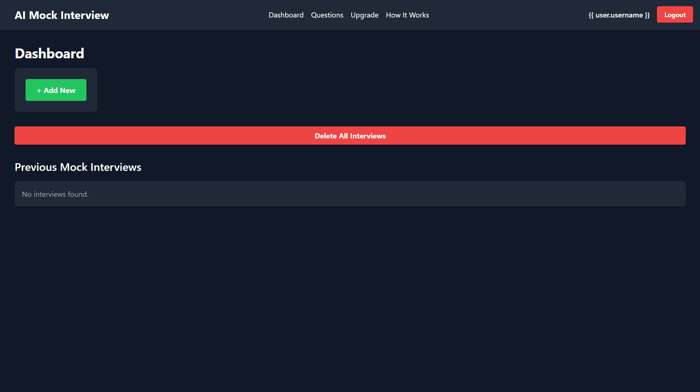

## 💼 AI Mock Interview System

> *"Practice like you've never won. Perform like you've never lost."*  
> A real-time, AI-powered mock interview platform designed to simulate technical interviews and help candidates boost their preparation with instant feedback and scoring.

---

### 🚀 Features

- 🎯 **Custom Interview Setup**  
  Choose your **job role**, **description**, and **years of experience** before starting.

- 🎤 **Real-Time Interview Simulation**  
  Your **webcam and mic** are activated to simulate a real interview experience.

- 🤖 **Smart Question Generation**  
  Uses **Gemini AI API** to generate interview questions based on your inputs.

- 🗣️ **Speech-to-Text Answer Recording**  
  Record your response with one click and automatically convert your speech to text.

- 📊 **AI-Powered Evaluation**  
  Your answers are evaluated for relevance, structure, and effectiveness using AI.

- 📈 **Detailed Feedback & Score**  
  Get a breakdown of:
  - Overall Score (/10)
  - Strengths
  - Areas for Improvement
  - Job-specific feedback

- 🔐 **Secure & User-Centric**  
  Integrated with **Clerk Authentication** for login and personalized dashboard.

---

### 🧠 Tech Stack

| Frontend            | Backend          | AI & APIs               | Auth         |
|---------------------|------------------|--------------------------|--------------|
| HTML, CSS, React.js | Flask (Python)   | Gemini API, NLP, WebRTC | Clerk.dev    |

---

### 📂 Folder Structure

```
📁 /frontend          → React UI for test screen & dashboard  
📁 /backend           → Flask server handling logic, Gemini API  
📁 /static/media      → Recorded answers, transcripts  
📁 /utils             → Evaluation & feedback modules  
```

---

### 📷 Preview


---

### 📌 How It Works

1. **User logs in**
2. Enters job details → starts interview
3. Sees a generated question + webcam starts
4. Answers are recorded, converted, and evaluated
5. Final report is shown with feedback

---

### 🤝 Want to Collaborate?

I'm open to feedback, contributions, or ideas to expand this project — like adding:
- Video storage
- Resume upload for smart question generation
- Mock HR round simulation

---

### 🔗 Live Demo (if applicable)
> [Coming Soon or add Vercel/Render URL]

---

### 📬 Contact

**Vedang Deshmukh**  
📧 vedangdeshmukh777@gmail.com  
🌐 [LinkedIn](https://www.linkedin.com/in/vedang-deshmukh-249730249) | [GitHub](https://github.com/vedang18200)

---

### ⭐️ Don't forget to Star the repo if you find it useful!
